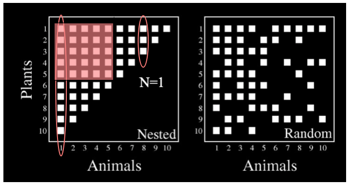

## Basic description of a network

There are a number of descriptors for a network. Generally just too many. In my opinion, the most important thing when analyzing ecological network properties is to have a clear idea of the biological meaning of these indexes. I mean, to have a sound biological interpretation of the variation we found and report in our study. The `R` package `bipartite`, for example, provides up to 34 different indexes within its `networklevel` function. We should use just those relevant to our ecological questions in our analysis, and be able to give proper biological interpretation of their results. The `bipartite` package provides worked examples (see e.g., fucntion `networstats`) illustrating specific analysis with a clear biological motivation, such as the analysis presented by [@Vazquez:2009]. 

Among the many packages in `R` used for network analysis, the following ones are the most frequently used, together with some general-purpose packages also included. 


```{r packages, echo=TRUE, warning=FALSE, message=FALSE, eval=FALSE}
## Classic analysis tools.
# require(statnet)  # A general package for network analysis.
require(sna)        # General package for network analysis.
require(network)     # General package for network analysis.
require(igraph)     # General package for network analysis.
require(intergraph) # Format exchange for networks.
require(bipartite)  # Statistical analysis for bipartite networks.
require(networksis) # Network models; simulation of bipartite graphs.
require(tnet)       # Statistical analysis of bipartite networks.
require(ggnet2)     # Included in the GGally utilities (see below).
require(ggnetwork)  # Networks plotting in ggplot2 grammar.

## Packages within the tidyverse framework and utils.
require(devtools)   # Tools for development packages.
require(ggplot2)    # Data visualisations using the 'Grammar of Graphics'.
require(GGally)     # GGally extends ggplot2 by adding several functions.
require(tidyverse)  # For general data manipulation and visualization.
require(tidygraph)  # For manipulating and analyzing network graphs.
require(ggnetwork)  # Network visualization in ggplot2.
require(ggraph)     # Visualizing objects created with the tidygraph package.

## The htmlwidgets set of packages makes it possible to use R to
## create interactive JavaScript visualizations.
require(networkD3)  # Dynamic visualizations.
require(bipartiteD3)# D3 plots for bipartite networks.
require(visNetwork)
require(RSiena)     # Fits statistical models to longitudinal sets of networks.

## Ecological data analysis packages useful with network analysis.
require(vegan)      # General package for ecological data analysis.
require(ade4)       # General package for ecological data analysis.
require(ape)        # Phylogenetic data analysis
require(picante)    # Phylogenetic data analysis

## Sourcing functions and packages
# I'm sourcing here these functions yet they should be available if you have my package `ggbipart` installed.
# Source the functions files
source("./code/sourcedir.R")
sourceDir("./code/functions/")

```


```{r basic_descriptors1, eval= T, echo=TRUE, fig.width=8}
# Read a network
# Where file data.txt has a weighted adjacency matrix, e.g.,:
#     Aa	Ab	Ac	Ba	Bb	Bc	Bd	Ca	Cb	Cc	Da
# P1	139	60	 9	23	4	104	5	3	5	2	1
# P2	184	26	6	10	3	6	17	11	3	1	0
# P3	131	74	33	36	13	19	0	9	1	1	0
# P4	87	40	38	21	13	0	9	0	0	0	0
# P5	100	42	17	12	4	1	1	0	0	0	0
# P6	21	15	7	0	4	1	1	0	0	0	0
# P7	42	16	3	0	2	0	0	0	0	0	0
# P8	31	8	4	5	1	2	0	0	0	0	0
# P9	46	8	2	0	3	0	0	0	0	0	0
# P10	86	0	0	12	0	2	0	0	0	0	0
# P11	23	8	1	5	1	0	0	0	0	0	0
# P12	13	6	1	1	1	0	0	0	0	0	0
# P13	5	0	1	0	0	0	0	0	0	0	0
# P14	9	1	0	0	0	0	0	0	0	0	0

# A bipartite graph from adjacency matrix text file ----------------------
mymat <- as.matrix(read.table("./data/data.txt",
                              header= T, sep= "\t", dec= ".",
                              na.strings= "NA",
                              row.names= 1))
source("./code/sourcedir.R")
sourceDir("./code/functions")
mymat.net<- bip_init_network(mymat)

bip_binplot(mymat, mymat.net, 
                   vertex.cex=3,
                   label.cex= 0.9)

```


### 1. Size
The most basic characteristic of a network is its size. The size is simply the number of members, usually called nodes, vertices or actors. The `network.size()` function is the easiest way to get this. The basic summary of a statnet network object also provides this information, among other things. The size of a unipartite adjacency matrix $M$ is given by its $m$ nodes. The size of a bipartite adjacency matrix $M$ is given by the sum of its $m$ nodes in the lower level (one of the modes) and its $n$ nodes in the upper level. 

Here are the basic networks descriptors:

```{r basic_descriptors2, eval= T, echo=TRUE}
# Network size
# 
network.size(mymat.net)

mymat.net

# Basic network data
summary(mymat.net)

```

Here are all the networks descriptors available in `R` package `bipartite`, function `networklevel`, and then my preferred set of descriptors:

```{r all_descriptors, eval= T, echo=TRUE}
# Network descriptors, all.
# 
networklevel(Safariland, index="ALLBUTDD") #excludes degree distribution fits

# My preferred set of descriptors for ecological networks
networklevel(Safariland, 
             index= c("connectance",
                      "weighted connectance",
                      "web asymmetry",
                      "links per species",
                      "number of compartments",
                      "cluster coefficient", 
                      "NODF",
                      "weighted NODF",
                      "ISA",
                      "SA",
                      "Fisher alpha",
                      "interaction evenness",
                      "Shannon diversity",
                      "H2"), 
             level="both", weighted=TRUE, 
             ISAmethod="dependence",  
             nrep = 100, normalise=TRUE, empty.web=TRUE, 
             logbase="e", intereven="prod", 
             H2_integer=TRUE, fcweighted=TRUE, 
             fcdist="euclidean", legacy=FALSE)

```

Note above that `level= "both"`, meaning that both modes of the network are included. In case we want the statistics for just one set of the species (e.g., the plants) we state: `level= "lower"`. In package `bipartite` the two modes of the network are called "lower" and "higher" to refer to the two sets of species. The lower level is indicated in the adjacency matrix as the files of the matrix; the higher level is indicated by the columns. So, in `Safariland` we have a matrix of 9 plant species and 17 pollinator species corresponding to the lower and higher trophic levels, respectively.


### 2. Density 

Of all the basic characteristics of a network, density is among the most important as well as being one of the easiest to understand. 

Density, also known as connectance, is the proportion of observed links (also called ties, edges, arcs, or relations) in a network to the maximum number of possible links [@Jordano:1987]. Thus, density is a ratio that can range from 0 to 1. The closer to 1 the density is, the more interconnected is the network.

Density is relatively easy to calculate, although the underlying equation differs based on whether the network links are directed or undirected. It also varies for unipartite and bipartite networks. 

An undirected link is one with no direction. Collaboration would be a good example of an undirected link; if A collaborates with B, then by necessity B is also collaborating with A. Directed links, on the other hand, have direction. Money flow is a good example of a directed link Also, trophic interactions in a food web, where energy flows from prey top predators, etc. Just because A gives money to B, does not necessarily mean that B reciprocates. 

For a directed network, the maximum number of possible link among $k$ actors is $$k ∗ (k − 1)$$, so the formula for density is:
$$
\frac{L}{k(k−1)}
$$

where $L$ is the number of observed ties in the network. Density, as defined here, does not allow for links between a particular node and itself (called a loop).

For an undirected network the maximum number of links is $k ∗ (k − 1)/2$ because non-directed links should only be counted once for every dyad (i.e., pair of nodes). So, density for an undirected network becomes:

$$
\frac{2L}{k(k−1)}
$$

This is valid for one-mode, undirected networks. Bipartite networks frequently have a different number of nodes between the two component modes. For example, in a plant-pollinator assemblage the number of pollinator species $A$ is usually larger than the number of plant species, $P$. So, the density of a bipartite network is given by [@Jordano:1987]:

$$
\frac{L}{{k_A}{k_P}}
$$

where `k_Ak_P` is the maximum number of possible links (adjacency matrix size).

We could then use `R` to calculate density by hand, but it is easier to simply use the `gden()` function in `statnet`. The appropriate statistics for connectance for bipartite networks are included in the package `bipartite`. Also note that the `summary` function of any network object will report its density.
 
```{r gden, eval= T, echo=TRUE}
# Connectance
gden(mymat.net)

# For the Safariland dataset in library(bipartite)
SFL.net<- bip_init_network(Safariland)
gden(SFL.net)

# Using bipartite package, very basic description, including connecetance and other indexes.
networklevel(Safariland, index="info")

```


### 3. Degree
Although the overall size of a network may be interesting, a more useful characteristic of the network is how connected it is, given its size and degree of node connectedness. 

The degree of a node, `k`, is the number of links it has with other nodes in the network. In bipartite graphs those links occur only between nodes of different modes, e.g., plant species linked with animal species but not linked among them.

```{r descriptors, echo= TRUE, eval= TRUE}
# Using bipartite package
networklevel(Safariland, index="info")

```


Connectance is the realized proportion of potential links [@Dunne:2002]: sum of links divided by number of cells in the matrix (= number of higher times number of lower trophic level species). This is the standardized number of species combinations often used in co-occurrence analyses [@Gotelli:1996].

A basic descriptor of the connectivity patterns in a network is the degree distribution, i.e., the frequency distribution of the number of links across nodes. for the lower level we may have the degrees of species as a vector with just `colSums(mat)`; for the higher level we msy give just `rowSums(mat)`, given the adjacency matrix `mat`.

To get the frequency distributions of degrees for the lower (e.g., plant) and upper (e.g., animals) levels we can use a simple function that just plots the histograms for $k_P$ and $k_A$, the vectors of degrees for each mode:

```{r degree_distrib1, echo=T, eval= T}
# Degree distribution
#
# Assign dataset as, e.g., degreedistrib(mat), where mat is any binary matrix
# with or without row/col labels.

# This is the function.
degreedistrib<-function(mat, fit, ...) {
    par(mfrow= c(1,2))
    mat<- ifelse(mat==0,0,1)
# For plants (higher trophic level)
    ddhigher <- colSums(mat)     # Plants
    hih <- hist(ddhigher, -1:max(ddhigher), plot = T)$intensities
    hih

# For animals (lower trophic level)
    ddlower <- rowSums(mat)      # Animals
    rm<-max(rowSums(mat))
    hil <- hist(ddlower, -1:max(ddlower), plot = T)$intensities
    hil
}

degreedistrib(kato1990)

```


We can also easily obtain the degree distribution with function `degreedistr` in `R` package `bipartite`, which gives the fits of the cumulative distribution to different theoretical models. The analysis of goodness-of-fit of the degree distributions to theoretical models is best suited for large (very large) networks, where the fits can be robsutly estimated on the basis of a large number of distinct degree values. Thi sis not possible in the (usually) small- to medium-size networks frequently analyzed in ecological studies.

```{r degeree_distrib, warning=FALSE, echo=TRUE, eval= TRUE, fig.width= 8}
# Degree distribution for both levels.
degreedistr(elberling1999, subsample=1, seed=NULL)

```


### 4. Clustering: the different forms of node aggregation

There is a marked trend for nodes in a network to get grouped within more densely-connected groups (clusters). Such clustering processes give rise to modular structure, cliques, compartments or other forms of aggregation. There are a number of indexes to assess such structural properties of aggregation. The simplest one is clustering. Yet most analyses of clustering (as well as other network and node properties) of bipartite networks are done on the unipartite projections of the network, simply because there are no extensions of one-mode indexes to the two-mode structure of the bipartite networks [@Opsahl:2013]. 

```{r clustering}
# Clustering for bipartite network.
clustering_tm(olesen2002flores, subsample=1, seed=NULL)
clustering_tm(Safariland, subsample=1, seed=NULL)
clustering_tm(elberling1999, subsample=1, seed=NULL)
clustering_tm(kevan1970, subsample=1, seed=NULL)

```

## Topology

An adjacency matrix:

$$
\left(\begin{array}{cccc}0 & 1 & 1 & 1 \\1 & 0 & 1 & 0 \\1 & 1 & 0 & 0 \\1 & 0 & 0 & 0\end{array}\right) 
$$

The following `R` code specifies the matrix $A$ depicted above, and calculates and prints the largest eigenvalue and the associated eigenvector.

```{r eval=FALSE}
# Specify the adjacency matrix
A <- matrix(c(0,1,1,1,1,0,1,0,1,1,0,0,1,0,0,0 ),4,4, byrow= TRUE)
EV <- eigen(A)          # compute eigenvalues and eigenvectors

EV$values               # Eigenvalues
max(EV$values)          # Find the maximum eigenvalue
 
# get the eigenvector associated with the largest eigenvalue
centrality <- data.frame(EV$vectors[,1]) 
names(centrality) <- "Centrality"
print(centrality)

```


The absolute values are proportional to the measures of eigenvector centrality for each vertex in the network.

```
Vertex  EV Centrality
1       .6116285
2       .5227207
3       .5227207
4       .2818452

```

We can see that vertex 1 has the highest measure of eigenvector centrality, followed by #2  and #3, and #4 as the lowest values.


## Structure

### Nestedness

Nestedness is a property of secondary structure of a network. It indicates to what extent the interactions of less connected nodes form proper subets of the interactions of more connected nodes. So, a high nestedness indicates a tendency for  the interactions of the nodes with greater interaction specificity to be included among those of the nodes with progressively higher generalization.

In this figure, the left panel shows an adjacency matrix for a perfectly nested network: the three interactions (white squares) of animal species #8 are included among those of the more generalized animal species #1. And the whole range of interaction richness among nodes forms a perfect gradient. In panel right matrix, the interactions are distributed randomly among nodes.



There are a number of ways to estimate nestedness, usually suing the `bipartite` package [@Dormann:2008] just to get the values according to several nestedness indices, and the `vegan`package [@vegan:2018], used to test the statistical significance of an empirical nestedness value.

A recommended index for nestedness, called `nestednodf` in `vegan` is `NODF`. High values indicate nestedness. According to the analysis of [@Almeida-Neto:2011], NODF is more consistent and “better” than other measures of nestedness. There is also a quantitative measure of nestedness [@Almeida-Neto:2011]. 

```{r nestedness, echo=TRUE, eval=TRUE, fig.width=8}
# Nestedness
library(vegan)

## Use oecosimu to assess the non-randomness of nestedness statistics.
out1<- nestednodf(elberling1999, order= TRUE)
plot(out1)
out2<- nestednodf(ollerton2003, order= TRUE)
plot(out2)

# Example with a weighted, quantitative network
data<- read.table("./data/data.txt", head=TRUE)
out3<- nestednodf(data, order= TRUE)
plot(out3)

```

For testing the significance, we use null models, generating random matrices and comparing the frequency distribution of randomized values with the observed value.

```{r randomization, echo=T, eval= T, warning=FALSE, fig.width= 8}
# Statistic value for observed network.
TIME <- Sys.time()

obs <- unlist(networklevel(elberling1999, index="NODF"))
cat("NODF= ", obs)

# Generate random networks according to a given null model.
# Method #5 is mgen, adequate for binary data.
nulls <- nullmodel(elberling1999, N= 99, method= 4)

# Estimate statistic for all the randomnized networks.
null <- unlist(sapply(nulls, networklevel, index="nestedness")) 
head(null)          # Estimated random values.

# Plot histogram for randomized values and compare observed value. 
plot(density(null), xlim= c(min(obs, min(null)), max(obs, max(null))))
abline(v=obs, col="red", lwd=2)    

# Estimate P-value
z <- (obs - mean(null))/sd(null)         
p <- 2*pnorm(-abs(z))
cat("P-value= ",p," ")          # P-value
Sys.time() - TIME 
#
# Plot
p <- ggplot(data= as.data.frame(null)) + theme_bw() + 
            geom_density(aes(x=null, y = ..density..), color = 'blue')
p + geom_vline(xintercept = obs, color="red") +
    labs(title= "Comparison of observed with null model mgen",
         x = "NODF")

```


### Modularity

The modularity of a network is the trend for subsets of nodes to interact more frequently among them than with other subsets of nodes [@Newman:2006]. We resort to the package `bipartite` to estimate modularity [@Dormann:2014], as it now implements a fast algorithm for its estimation [@Beckett:2016].

The `computeModules` function in the package `bipartite` gives the modularity estimated value and the `plotModuleWeb` function plots the modular structure of the assemblage. 

```{r modularity, echo=TRUE, eval=TRUE}
# Modularity

data(Safariland)
		(res <- computeModules(Safariland)) 
		plotModuleWeb(res)
		
```

To proceed with analyses of multiple datasets it is convenient to have a function, where we can also extract the roles of the different species:

```{r mod_function, echo=TRUE, eval=TRUE}
modularity <- function (mat) {
    require(bipartite)
    (res <- computeModules(mat)) # takes several minutes!
    printoutModuleInformation(res)
    cat(res@likelihood)
    plotModuleWeb(res,labsize=0.8)
}

modularity(Safariland)

```


To get a significance test for modularity we need to generate null models of the matrix links, reshuffle them multiple times and then compare their distribution (randomized values) with our empirical estimate. This is quite computer intensive, especially for large matrices.

There are many different types of null models [@Ulrich:2009] [@Fortuna:2010] and none of them is perfect. The options included in package `bipartite` are 1/`r2dtable`, 2/`swap.web`, 3/`vaznull`, 4/`shuffle.web`, 5/`mgen`. Methods 1 to 4 work for quantitative webs, 4 and 5 for binary. The different methods vary in the way they generate the expected values for cells and how they reshuffle rows and columns to get the randomized matrices. A full discussion of null models is given in package `vegan` (its function `nullmodel`), including a more diverse range of model types. 


```{r mod_significance, echo=TRUE, eval=TRUE}
# Testing modularity significance (@30 min for 100 null replicates)
TIME <- Sys.time()
mat <- Safariland                   # Assign the observed matrix
res <- computeModules(mat)          # Modularity for observed matrix
nulls <- nullmodel(mat, N= 99, method= 3)
modules.nulls <- sapply(nulls, computeModules)
like.nulls <- sapply(modules.nulls, function(x) x@likelihood)
z <- (res@likelihood - mean(like.nulls))/sd(like.nulls)
p <- 2*pnorm(-abs(z))
cat("P-value= ", p," ")          # P-value
Sys.time() - TIME 

#
# Plot
p <- ggplot(data= as.data.frame(like.nulls)) + theme_bw() + 
            geom_density(aes(x=like.nulls, y= ..density..), color= 'blue')
p + geom_vline(xintercept= res@likelihood, color= "red") +
    labs(title= "Comparison of observed with null model vaznull",
         x = "Modularity")

```


------------------------------------------------------------------------------

## Session

```{r session, echo=T}
sessionInfo()

```


## References

