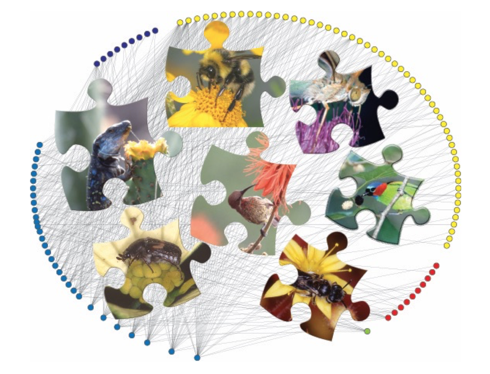

# Workshop Universidad de Sevilla. Feb 2022.
### Pedro Jordano
*Estación Biológica de Doñana, CSIC -Sevilla, Spain*
March 22, 2019; December 22, 2021

### Materials for the US 2022 Course "*Biodiversidad y evolución de redes complejas de interacciones entre especies*".
A short introduction to the analysis of complex ecological networks.

## Introduction

A network is a representation of multiple links among interconnected elements. Networks are everywhere, simply because we live an inteconnected world.

Network science is a broad approach to research and scholarship that uses a relational lens to study and understand biological, physical, social, and informational systems. The primary tool for network scientists is network analysis, the set of methods that are used to (1) visualize networks, (2) describe their specific characteristics and structure, and the details about the individual nodes, links, and subgroups within the networks, and (3) build mathematical and statistical models of network structure and dynamics.

Network ecology deals with three main aspects of biodiversity: 1) visualize the complexity of interactions within ecosystems, among individual organisms, among species, or among higher taxonomic entities; 2) map ecological functions on the links; 3) analyze and test network patterns; and 4) fit network models aiming to understand the mechanistic bases of network complexity. Network tools are thus extremely useful for ecologists, because visualization of complexity is a first step to its understanding.

This is a short workshop where I aim to present a simple overview of the analysis of ecological networks in R, based on my own experience when analyzing network data and the experience of others that I found particularly useful. In most cases I use my own data and examples, all of them available in my GitHub repository or our lab repository. A general introduction to ecological networks, with emphasis on mutualistic interactions is [1]; recent, more general approaches to the analysis of complex neworks in R are summarized in [2]. Further recent work has focused on graphical representation and analysis of ecological networks[5]. A general introduction to complex network analysis is [6].

References
1. Bascompte J, Jordano P. 2014. *Mutualistic networks*. Princeton, NJ: Princeton University Press
2. Kolaczyk ED, Csárdi G. 2014. *Statistical analysis of network data with *R. Cambridge, MA, USA: Springer
3. Pocock MJO, Evans DM, Fontaine C, Harvey M, Julliard R, et al. 2016. The visualisation of ecological networks, and their use as a tool for engagement, advocacy and management. *Advances in Ecological Research*. 54:41–85. 1st ed.
4. Farine DR. 2017. A guide to null models for animal social network analysis. *Methods in Ecology and Evolution*. 8(10):1309–20.
5. Delmas E, Besson M, Brice M-H, Burkle L, Riva GVD, et al. 2018. Analyzing ecological networks of species interactions. *bioRxiv*, p. 112540.
6. Barabási, A.L. 2019. *Network science*. Cambridge University Press, Cambridge, USA.

  Licensed under a Creative Commons Attribution-ShareAlike 4.0 International License.
  2018 - Pedro Jordano 
